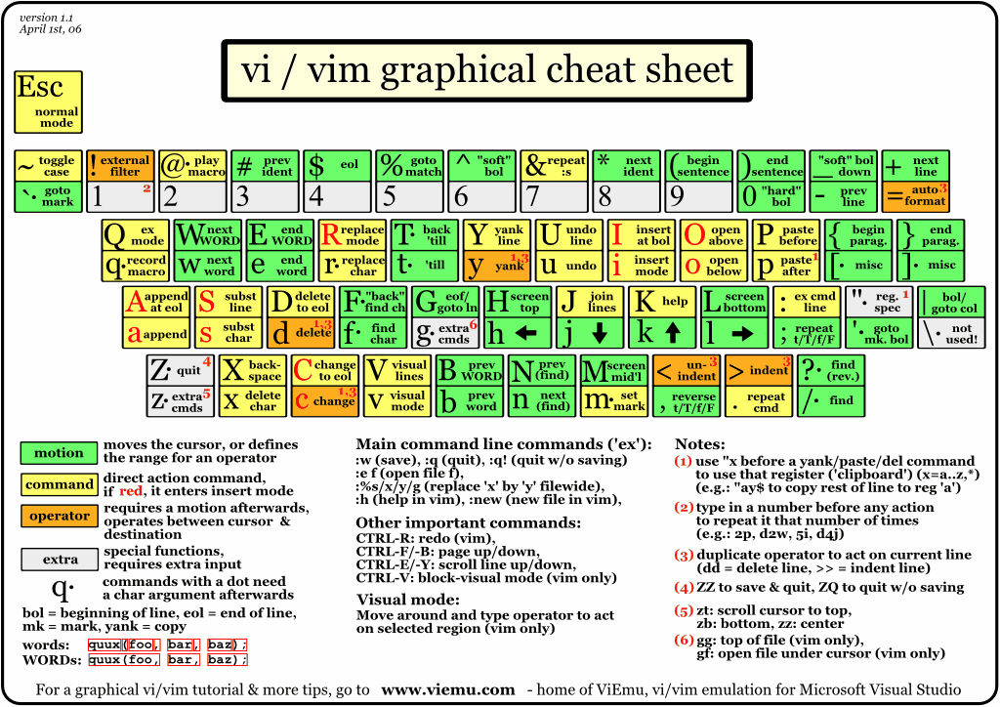

## Command line shortcut

* `ctrl+/`: undo
* `alt+/`: redo
* `ctrl+w`: delete word(backword)
* `alt+d`: delete word(forward), and put it into buffer
* `ctrl+k`: delete to end of line, and put it into buffer
* `ctrl+u`: delete to the start of te line, and put it into buffer
* `ctrl+u`: save to buffer (see also above)
* `ctrl+y`: paste from buffer( which filled by prevous delete commands)
* `ctrl+t`: swap char with previous one
* `alt+t`: swap word with previous one
* `meta+f`: forward a word (note, on macosx, you need change Terminal to user alt as meta key)
* `meta+b`: backward a word

## vi/vim graphical cheet sheet
* `w`: move right one word
* `b`: move left one word

## Reference

* [Bash shortcuts for maximum productivity](http://www.skorks.com/2009/09/bash-shortcuts-for-maximum-productivity/)
